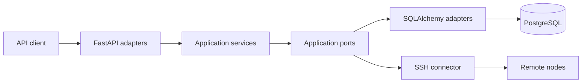

# Architecture Overview

Node Nexus API is a modular monolith. FastAPI adapters expose HTTP and WebSocket
protocols, application services implement use cases, persistence adapters manage
PostgreSQL state, and connector adapters communicate with remote nodes over SSH.

## Context

## Modules

- `app/api`: HTTP and WebSocket protocol adapters.
- `app/application`: use-case DTOs, ports, and orchestration services.
- `app/services`: existing application services being incrementally migrated.
- `app/services/docker`: focused Docker runner and container/image/resource/bulk
  use cases behind a small compatibility facade.
- `app/adapters/persistence`: short-scope readers and writers for long-running
  command, script, Docker, and WebSocket operations.
- `app/repositories`: SQLAlchemy persistence adapters.
- `app/models`: database representation.
- `app/schemas`: public API contracts.
- `app/core`: configuration, domain errors, security, and connector primitives.
- `app/di`: composition root and resource lifecycle.

## Architectural invariants

1. API adapters do not access ORM models or repositories.
2. Application use cases do not depend on FastAPI or SQLAlchemy.
3. Remote I/O does not run while a database transaction is held open.
4. An `AsyncSession` is never shared by concurrent tasks.
5. Application-scoped resources are finalized by the DI container.
6. Domain errors are converted to HTTP responses in one place.
7. Public API contracts remain backward compatible unless an ADR explicitly
   approves a breaking change.

## Current deployment model

The application is intentionally optimized for a single API process. The
scheduler and rate limiter are in-process components. Multi-replica coordination,
distributed locks, and external workers are outside the current scope.

## Related decisions

- [ADR-001: Layer boundaries](decisions/ADR-001-layer-boundaries.md)
- [ADR-002: Session and transaction scope](decisions/ADR-002-session-and-transaction-scope.md)
- [ADR-003: Scheduler lifecycle](decisions/ADR-003-scheduler-lifecycle.md)
- [ADR-004: WebSocket orchestration](decisions/ADR-004-websocket-orchestration.md)
- [ADR-005: Domain error mapping](decisions/ADR-005-domain-error-mapping.md)
