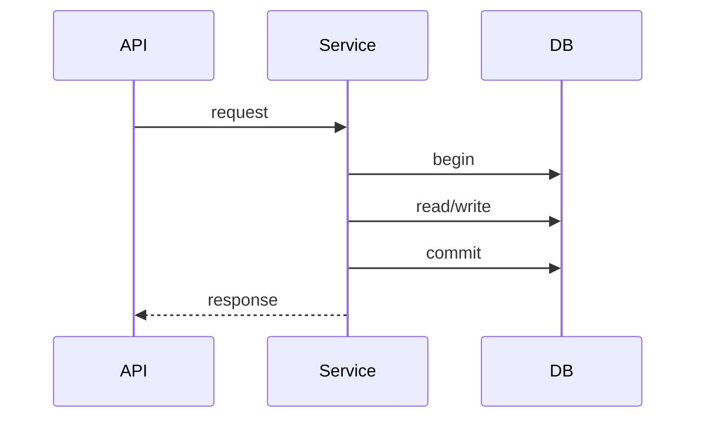
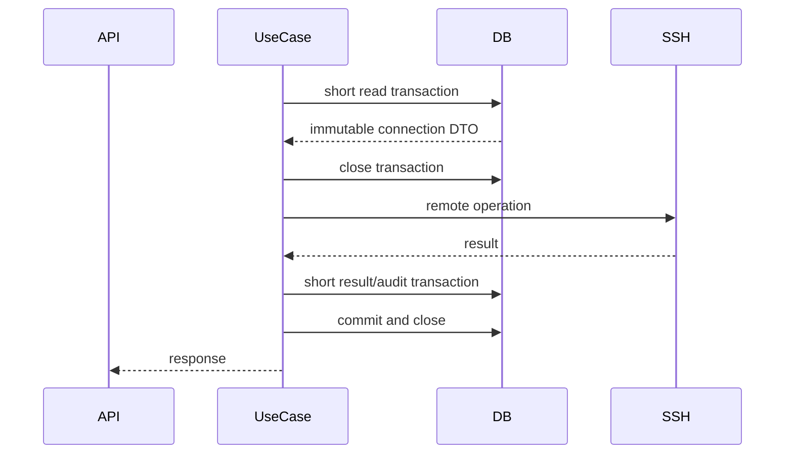

# Transaction Model

## Principles

- One `AsyncSession` represents one sequential transaction.
- A session is never shared between tasks created by `asyncio.gather`.
- Database transactions contain database work only.
- SSH, Docker, and other remote I/O run outside database transactions.

## Short CRUD use case

Request-scoped repositories are acceptable for short CRUD operations.

## Remote operation

## Bulk operation

Bulk execution follows three distinct phases:

1. Preload all targets and convert them to immutable DTOs.
2. Execute remote work concurrently without database access.
3. Persist results and audit events after all workers complete.

## Failure semantics

- An unexpected persistence error rolls back its current short transaction.
- A remote failure is represented as a domain result or domain exception.
- Audit persistence failure is logged and must not leave another transaction in
  a failed state.
- Cancellation must finalize connectors and any active persistence scope.
