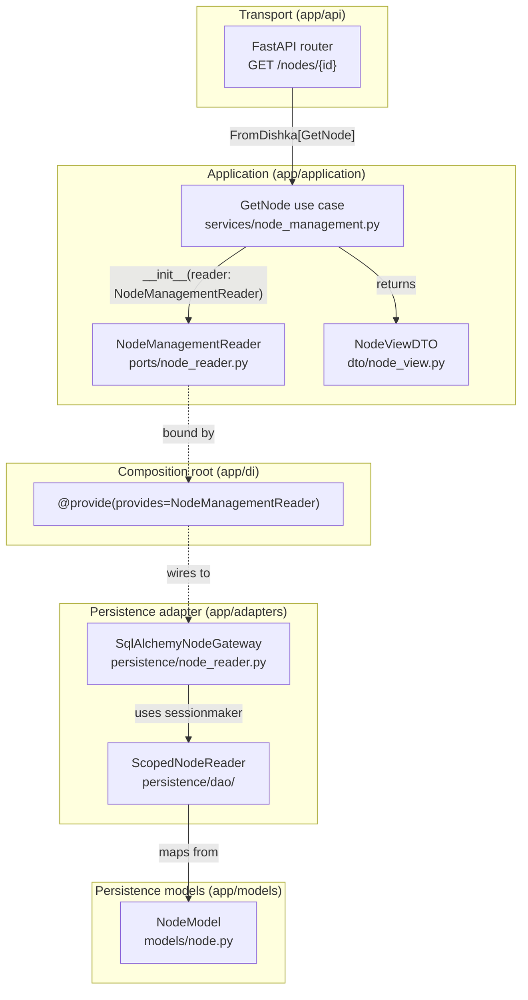

# Dependency rules

Dependencies point inward:

```text
inbound adapters -> application use cases -> DTOs / policies / ports
outbound adapters -> application ports
persistence adapters -> internal DAOs -> SQLAlchemy models
DI composition -> application contracts + concrete adapters
```

Application must not import FastAPI, Pydantic transport schemas, SQLAlchemy,
Dishka, ORM models, or concrete adapters. API modules do not import persistence
or runtime implementations. ORM-to-DTO mapping belongs to persistence adapters.
The composition root is the only place that binds a port to an adapter, using
explicit `provides=Port`. Architecture tests enforce these boundaries.

## Concrete example



Each arrow crosses exactly one architectural boundary. The router never sees
ORM models; the use case never imports SQLAlchemy; the adapter never exposes
`AsyncSession` to the application layer.
