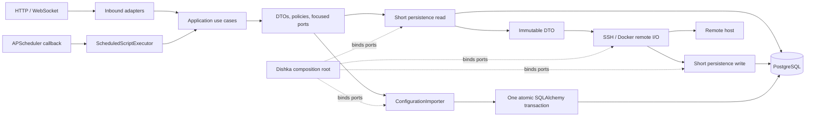

# Architecture overview

Node Nexus uses Ports & Adapters. HTTP, WebSocket, and scheduler adapters call
inbound application use cases. Use cases depend on immutable DTOs and focused
ports. SQLAlchemy, SSH, Docker, security, and scheduler implementations are
outbound adapters connected only by the Dishka composition root.

Pydantic models are transport contracts and SQLAlchemy models are persistence
details; neither crosses the application boundary. Dishka creates APP and
REQUEST scopes. APP gateways own a sessionmaker, while request-transaction DAOs
own a session. SSH and Docker side effects run after the read session closes.

PostgreSQL is the system of record. The in-process scheduler uses advisory-lock
ownership so non-owner replicas can serve HTTP without executing jobs.

## Runtime flow

No live session or ORM model crosses from a persistence adapter into remote
I/O. The config branch is deliberately different: its dedicated port owns one
transaction because the complete payload is one atomic business operation.
