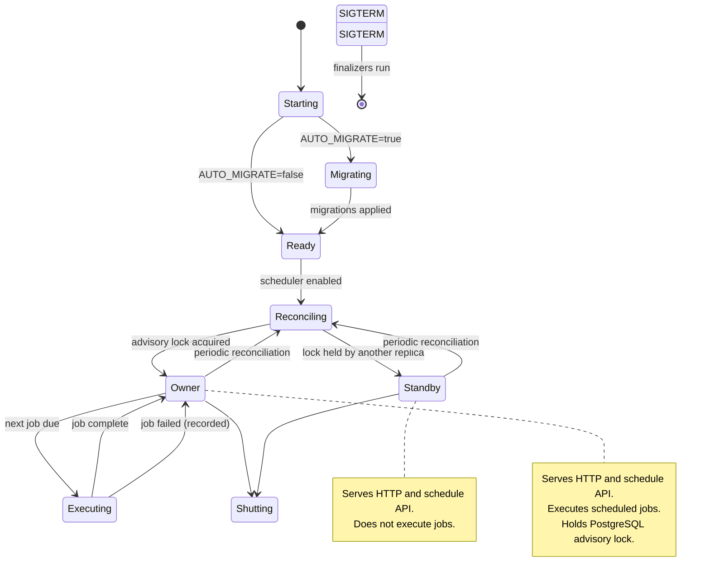

# Runtime lifecycle

The lifecycle adapter configures logging, optionally applies migrations, binds
the scheduler callback to `ScheduledScriptExecutor`, restores persistent
schedules, and cleans expired audit records. The durable audit outbox worker is
an APP resource. Telemetry and HTTP middleware are configured when the app is
created.

Request-scoped dependencies never escape their scope. APP use cases use
sessionmaker-owned short persistence adapters. Scheduler ownership is protected
by a PostgreSQL advisory lock, and reconciliation rebuilds APScheduler jobs from
persistent schedules. A non-owner replica serves HTTP but never executes jobs.

Shutdown closes the Dishka container; APP finalizers stop the scheduler and
audit worker and dispose the database engine.

## Startup and scheduler lifecycle

