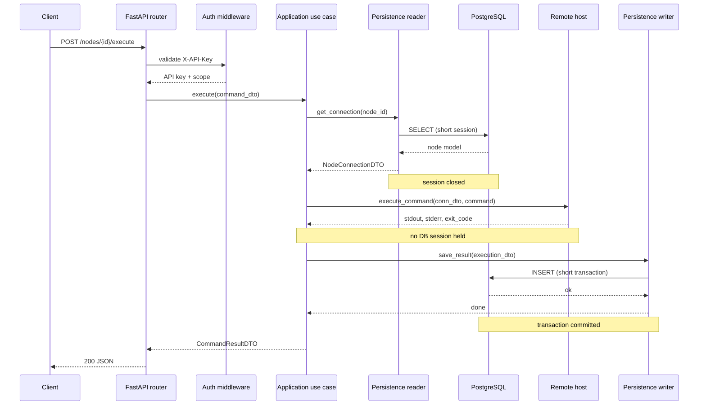

# Transaction model

Request CRUD uses one request-scoped SQLAlchemy session. The provider owns
commit and rollback; internal DAOs flush but do not commit independently.
APP-scoped gateways store an `async_sessionmaker`, never a live session.

Remote operations follow `short read -> immutable DTO -> close session ->
side effect -> short write`. Concurrent workers never receive a session, DAO,
or ORM model. Bulk operations report partial outcomes and do not promise
distributed rollback.

Multi-aggregate operations use dedicated boundaries only when atomicity is a
business requirement. Configuration import owns one transaction for the whole
payload; there is no universal application Unit of Work.

## Commit before response

For HTTP requests, `CommitOnResponseMiddleware` commits the request-scoped
transaction immediately before the application emits `http.response.start`.
This eliminates read-after-write races: a client cannot receive a successful
response and then observe stale state on the next request.

The middleware skips `/health`, `/ready`, and `/metrics`, and only commits when
the session has pending changes (`new`, `dirty`, or `deleted`). If commit fails,
the middleware rolls back and raises, so the client receives a 500 instead of a
false success.

## Request lifecycle

The gap between the read and the remote call is intentional: no database
connection or transaction is held during SSH or Docker I/O.
