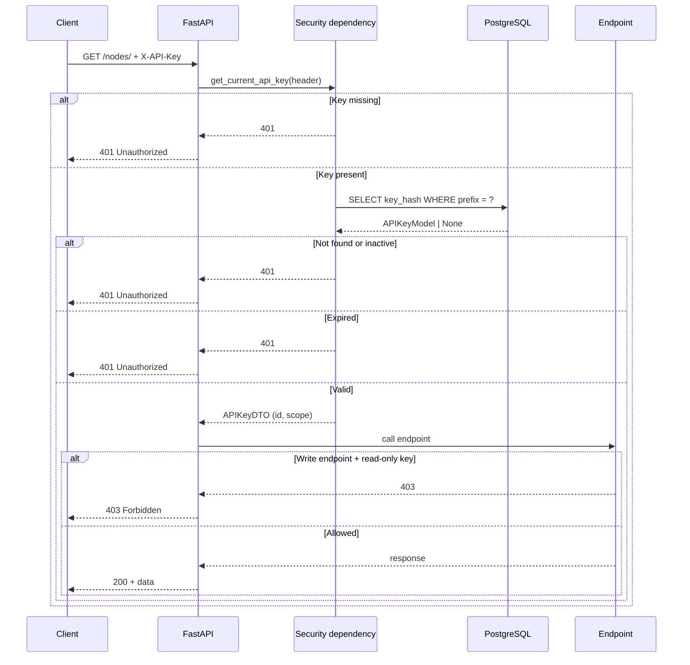

# Authentication

Node Nexus authenticates protected HTTP requests with the `X-API-Key` header.
Do not put a key in the query string: URLs are commonly retained in browser
history, access logs, and monitoring systems.

```bash
export NODE_NEXUS_URL=http://localhost:8000
export NODE_NEXUS_API_KEY='replace-with-your-key'

curl --fail-with-body \
  -H "X-API-Key: ${NODE_NEXUS_API_KEY}" \
  "${NODE_NEXUS_URL}/api/v1/nodes/"
```

The master key configured through `MASTER_API_KEY` always has read-write access.
Managed keys support `read-only` and `read-write` scopes. A read-only key can
list and inspect resources but receives `403 Forbidden` for mutations.

| Status | Meaning | Action |
|---|---|---|
| `401` | The key is missing, unknown, inactive, or expired | Check the header and key lifecycle |
| `403` | The key is valid but lacks write scope | Use a read-write key only for mutations |
| `429` | The process-local rate limit was exceeded | Back off and retry after the current window |

Store keys in a secret manager or protected environment variable. Never commit,
log, or paste them into issue trackers. See [API key lifecycle](api-keys.md) for
creation, expiration, rotation, and revocation.

## Rate limiting

Requests are rate-limited per client IP using a sliding window. The defaults are
100 requests per 60-second window, configured through `RATE_LIMIT_REQUESTS` and
`RATE_LIMIT_WINDOW`.

Every response includes:

| Header | Meaning |
|--------|---------|
| `X-RateLimit-Limit` | Maximum requests per window |
| `X-RateLimit-Remaining` | Requests remaining in the current window |

When the limit is exceeded, the response is `429 Too Many Requests` with:

| Header | Meaning |
|--------|---------|
| `Retry-After` | Seconds to wait before retrying |

Rate limiting is **process-local** (in-memory). In a multi-replica deployment,
each replica maintains its own counters. The `/health`, `/ready`, and `/metrics`
paths are excluded from rate limiting.

Clients should:
- Honor `Retry-After` and not retry immediately
- Use `X-RateLimit-Remaining` to throttle before hitting the limit
- Distribute requests across keys when possible (limits are per IP, not per key)

## How authentication works


