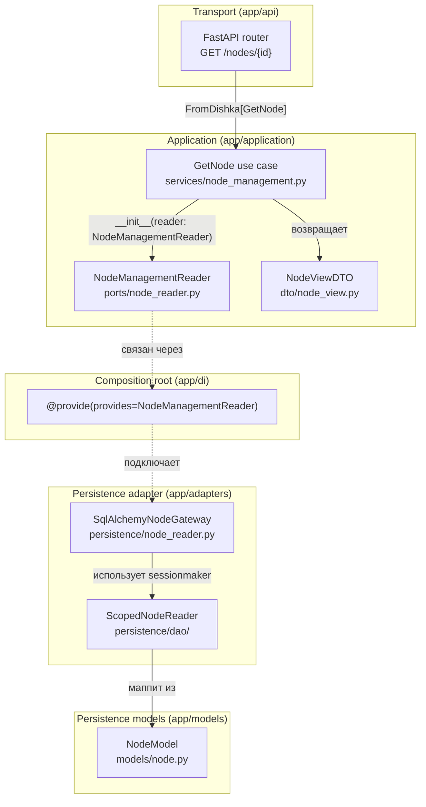

# Правила зависимостей

Зависимости направлены внутрь:

```text
inbound adapters -> application use cases -> DTOs / policies / ports
outbound adapters -> application ports
persistence adapters -> internal DAO -> SQLAlchemy models
DI composition -> application contracts + concrete adapters
```

Application не импортирует FastAPI, Pydantic transport schemas, SQLAlchemy,
Dishka, ORM models или concrete adapters. API modules не импортируют
persistence/runtime implementations. ORM-to-DTO mapping выполняется в
persistence adapter. Только composition root связывает port с adapter через
явный `provides=Port`. Границы проверяются architecture tests.

## Конкретный пример



Каждая стрелка пересекает ровно одну архитектурную границу. Router никогда не
видит ORM-модели; use case не импортирует SQLAlchemy; adapter не раскрывает
`AsyncSession` в application layer.
