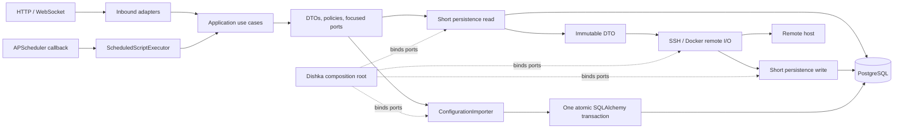

# Обзор архитектуры

Node Nexus использует Ports & Adapters. HTTP, WebSocket и scheduler adapters
вызывают inbound application use cases. Use cases зависят от immutable DTO и
focused ports. SQLAlchemy, SSH, Docker, security и scheduler implementations
подключаются только в Dishka composition root.

Pydantic models являются transport contracts, SQLAlchemy models — деталями
persistence; оба типа не пересекают application boundary. APP gateways хранят
sessionmaker, request-transaction DAO — session. SSH/Docker side effects
выполняются после закрытия read session.

PostgreSQL является system of record. In-process scheduler использует
advisory-lock ownership: non-owner replicas обслуживают HTTP, но не запускают
jobs.

## Runtime flow

Живая session или ORM model не пересекает границу persistence adapter перед
remote I/O. Ветка config намеренно отличается: отдельный port владеет одной
transaction, потому что полный payload является atomic business operation.
