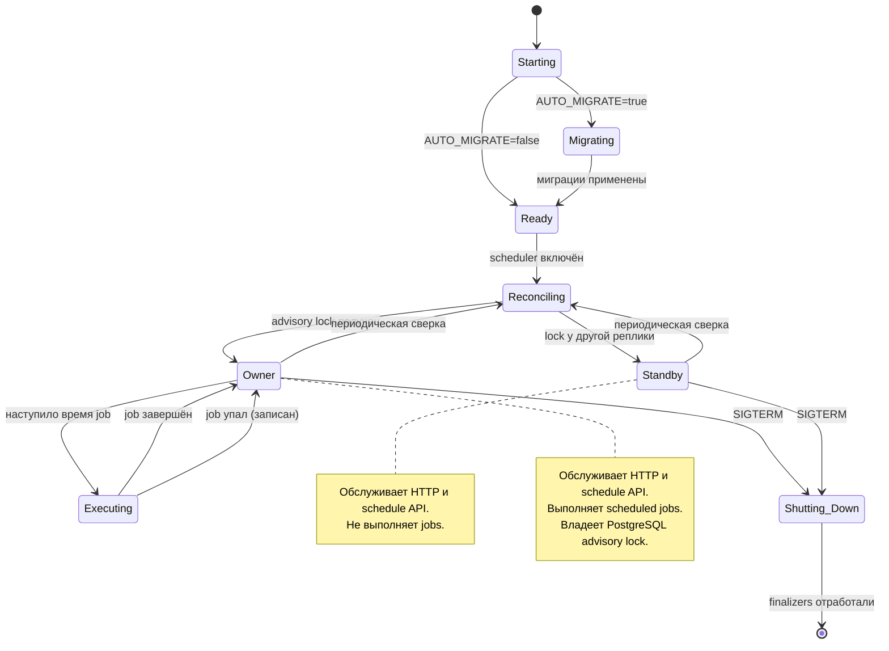

# Runtime lifecycle

Lifecycle adapter настраивает logging, опционально применяет migrations,
связывает scheduler callback с `ScheduledScriptExecutor`, восстанавливает
persistent schedules и очищает устаревший audit. Durable audit outbox worker
является APP resource. Telemetry и HTTP middleware создаются вместе с app.

Request-scoped dependencies не выходят за свой scope. APP use cases используют
sessionmaker-owned short persistence adapters. Scheduler ownership защищён
PostgreSQL advisory lock, reconciliation восстанавливает APScheduler jobs из
persistent schedules. Реплика без ownership обслуживает HTTP, но не выполняет
jobs.

При shutdown Dishka закрывает container; APP finalizers останавливают scheduler
и audit worker и освобождают database engine.

## Запуск и жизненный цикл планировщика

