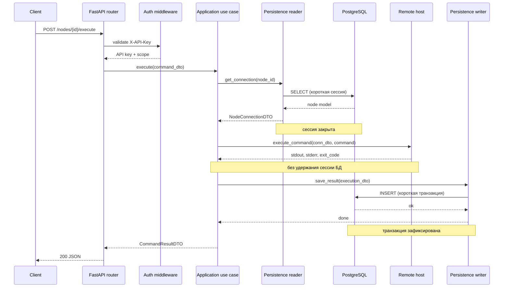

# Модель транзакций

Request CRUD использует одну request-scoped SQLAlchemy session. Provider владеет
commit и rollback; внутренние DAO выполняют flush без самостоятельного commit.
APP-scoped gateway хранит `async_sessionmaker`, но не живую session.

Remote flow: `short read -> immutable DTO -> close session -> side effect ->
short write`. Concurrent workers не получают session, DAO или ORM model. Bulk
operations возвращают частичные результаты без distributed rollback.

Multi-aggregate operation получает отдельную boundary только при бизнес-требовании
atomicity. Config import владеет одной transaction для всего payload;
универсального application Unit of Work нет.

## Жизненный цикл запроса

Разрыв между чтением и удалённым вызовом — намеренный: соединение с БД и
транзакция не удерживаются во время SSH или Docker I/O.
