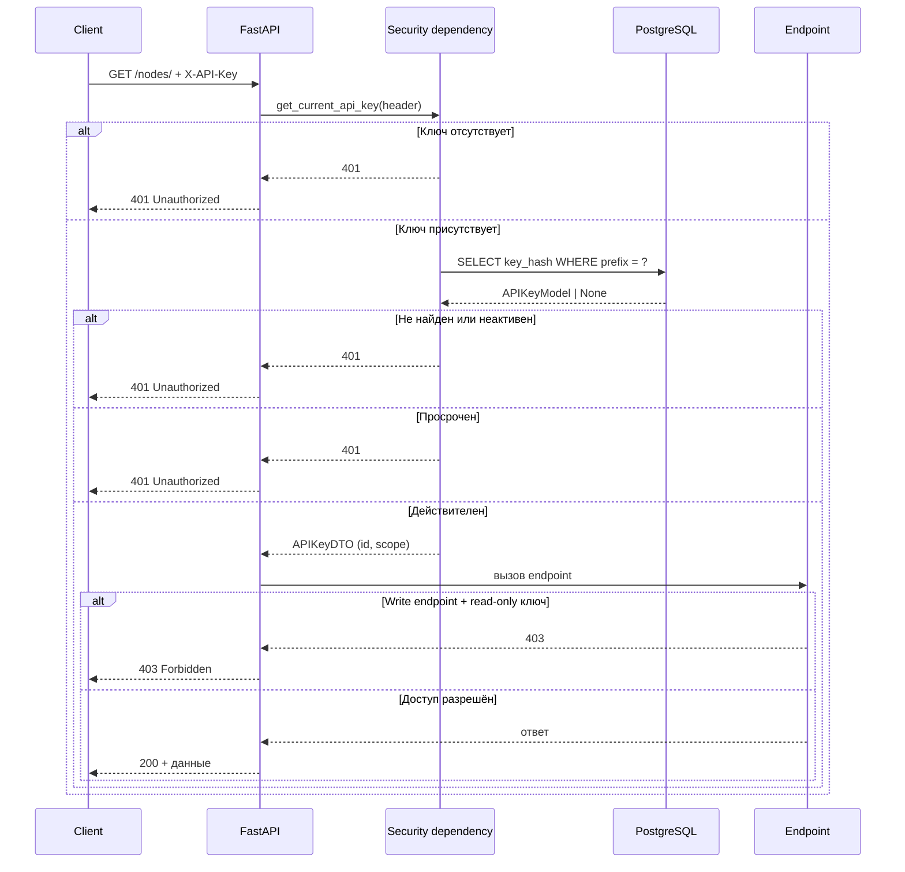

# Аутентификация

Node Nexus аутентифицирует защищённые HTTP-запросы по заголовку `X-API-Key`.
Не передавайте ключ в строке запроса: URL часто сохраняются в истории браузера,
журналах доступа и системах мониторинга.

```bash
export NODE_NEXUS_URL=http://localhost:8000
export NODE_NEXUS_API_KEY='replace-with-your-key'

curl --fail-with-body \
  -H "X-API-Key: ${NODE_NEXUS_API_KEY}" \
  "${NODE_NEXUS_URL}/api/v1/nodes/"
```

Мастер-ключ из `MASTER_API_KEY` всегда имеет права на чтение и запись.
Управляемым ключам можно назначить область `read-only` или `read-write`.
Ключ `read-only` позволяет просматривать ресурсы, но операции изменения
завершаются ответом `403 Forbidden`.

| Статус | Значение | Действие |
|---|---|---|
| `401` | Ключ отсутствует, неизвестен, отключён или просрочен | Проверьте заголовок и состояние ключа |
| `403` | Ключ действителен, но не имеет права на запись | Используйте `read-write` только для изменений |
| `429` | Превышен локальный для процесса лимит запросов | Сделайте паузу до следующего окна |

Храните ключи в менеджере секретов или защищённых переменных окружения. Не
коммитьте и не записывайте их в журналы или задачи. Создание, ротация и отзыв
описаны в [руководстве по API-ключам](api-keys.md).

## Ограничение частоты запросов

Запросы ограничены по IP клиента скользящим окном. По умолчанию: 100 запросов
за 60-секундное окно, настраивается через `RATE_LIMIT_REQUESTS` и
`RATE_LIMIT_WINDOW`.

Каждый ответ включает:

| Заголовок | Значение |
|-----------|----------|
| `X-RateLimit-Limit` | Максимум запросов за окно |
| `X-RateLimit-Remaining` | Осталось запросов в текущем окне |

При превышении возвращается `429 Too Many Requests` с:

| Заголовок | Значение |
|-----------|----------|
| `Retry-After` | Секунд до повторной попытки |

Ограничение — **process-local** (в памяти). В multi-replica deployment каждая
реплика ведёт свои счётчики. Пути `/health`, `/ready` и `/metrics` исключены
из ограничения.

Клиентам следует:
- Соблюдать `Retry-After` и не повторять запрос немедленно
- Использовать `X-RateLimit-Remaining` для упреждающего замедления
- По возможности распределять запросы между ключами (лимит per IP, не per key)

## Как работает аутентификация


